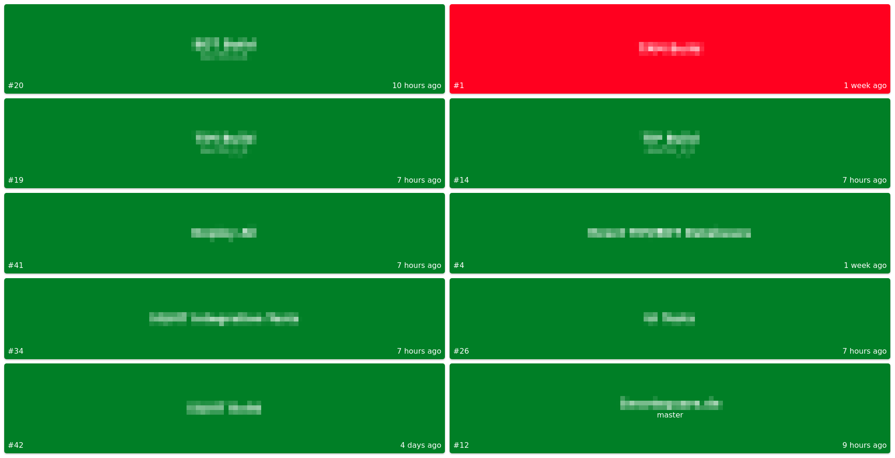

# Teamcity Build Monitor

This is a very simple build monitor for [Teamcity](https://www.jetbrains.com/teamcity/).<br>
The only requirement to run it is a `JVM` >= 8.

### Setup

You can download the latest `jar` from [here](https://github.com/rubengees/teamcity-build-monitor/releases/download/1.0.0/teamcity-build-monitor.jar).

#### Configuration

Before running, you need to setup some properties.<br>
Currently supported are:

Name              | Description                                                      | Example
----------------- | ---------------------------------------------------------------- | ---------------------------------------------
teamcity.url      | The url your teamcity server is reachable under.                 | `teamcity.url=https://teamcity.jetbrains.com`
teamcity.username | The username of the account you want to login with.              | `teamcity.username=test`
teamcity.password | The password of the account you want to login with.              | `teamcity.password=test`
teamcity.interval | The interval you want to refresh with. The default is 5 seconds. | `teamcity.interval=60000` (One minute)

If you do not specify a valid `username` and/or `password`, guest authentification is assumed. See the [template file](build.monitor.template.properties) to get an idea on how your properties should look like.

#### Starting

You can run the `jar` directly from the command line:

```bash
java -jar teamcity-build-monitor.jar --spring.config.location=file:./your.build.monitor.properties
```

You can also pass the individual properties directly:

```bash
java -jar teamcity-build-monitor.jar --teamcity.url=https://teamcity.test.com \
                                     --teamcity.username=test \
                                     --teamcity.password=test
```

You can then access the build monitor on `http://localhost:8080/buildMonitor`

If you want to adjust the port, you can do it like so:

```bash
java -jar teamcity-build-monitor.jar --server.port=1234
```

### More

This is mostly just a project for me to try out different technologies I'm interested in. While I will try to fix bugs if they come up, please don't expect outstanding support or the greatest code.<br>
You may do whatever you want to do with the code, as it is licensed under [MIT](LICENSE.txt).

Here is a screenshot of the current version:


